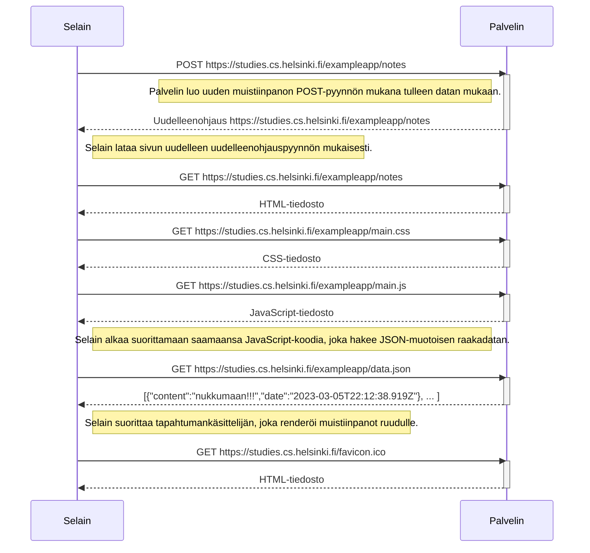

Tehtävä 0.4:

```mermaid
sequenceDiagram
    participant Selain
    participant Palvelin
	
	Selain->>Palvelin: POST https://studies.cs.helsinki.fi/exampleapp/notes
    activate Palvelin
	Note left of Palvelin: Palvelin luo uuden muistiinpanon POST-pyynnön mukana tulleen datan mukaan.
    Palvelin-->>Selain: Uudelleenohjaus https://studies.cs.helsinki.fi/exampleapp/notes
    deactivate Palvelin
	
	Note right of Selain: Selain lataa sivun uudelleen uudelleenohjauspyynnön mukaisesti.
    
    Selain->>Palvelin: GET https://studies.cs.helsinki.fi/exampleapp/notes
    activate Palvelin
    Palvelin-->>Selain: HTML-tiedosto
    deactivate Palvelin
    
    Selain->>Palvelin: GET https://studies.cs.helsinki.fi/exampleapp/main.css
    activate Palvelin
    Palvelin-->>Selain: CSS-tiedosto
    deactivate Palvelin
    
    Selain->>Palvelin: GET https://studies.cs.helsinki.fi/exampleapp/main.js
    activate Palvelin
    Palvelin-->>Selain: JavaScript-tiedosto
    deactivate Palvelin
    
    Note right of Selain: Selain alkaa suorittamaan saamaansa JavaScript-koodia, joka hakee JSON-muotoisen raakadatan.
    
    Selain->>Palvelin: GET https://studies.cs.helsinki.fi/exampleapp/data.json
    activate Palvelin
    Palvelin-->>Selain: [{"content":"nukkumaan!!!","date":"2023-03-05T22:12:38.919Z"}, ... ]
    deactivate Palvelin    

    Note right of Selain: Selain suorittaa tapahtumankäsittelijän, joka renderöi muistiinpanot ruudulle.
	
	Selain->>Palvelin: GET https://studies.cs.helsinki.fi/favicon.ico
    activate Palvelin
    Palvelin-->>Selain: HTML-tiedosto
    deactivate Palvelin  
```