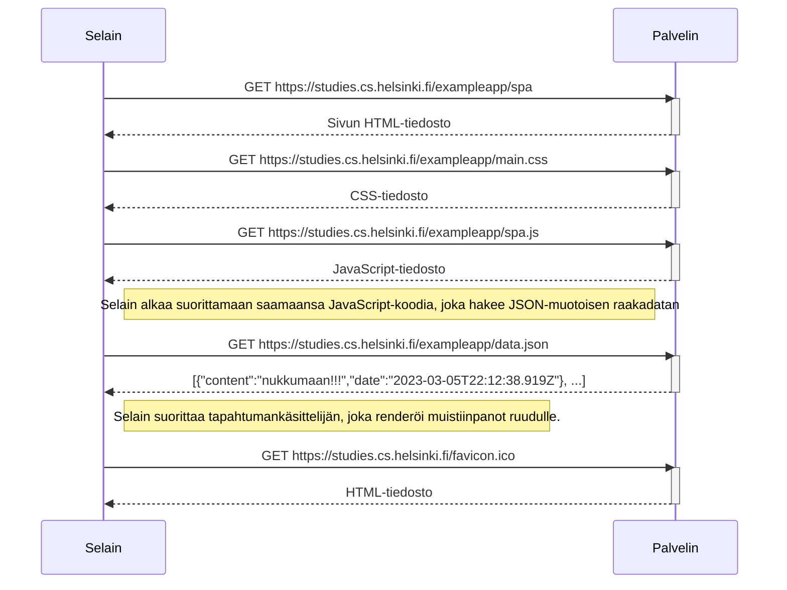

Tehtävä 0.5:

```mermaid
sequenceDiagram
	participant Selain
	participant Palvelin
	
	Selain->>Palvelin: GET https://studies.cs.helsinki.fi/exampleapp/spa
	activate Palvelin
	Palvelin-->>Selain: Sivun HTML-tiedosto
	deactivate Palvelin
	
	Selain->>Palvelin: GET https://studies.cs.helsinki.fi/exampleapp/main.css
	activate Palvelin
	Palvelin-->>Selain: CSS-tiedosto
	deactivate Palvelin
	
	Selain->>Palvelin: GET https://studies.cs.helsinki.fi/exampleapp/spa.js
	activate Palvelin
	Palvelin-->>Selain: JavaScript-tiedosto
	deactivate Palvelin
	
	Note right of Selain: Selain alkaa suorittamaan saamaansa JavaScript-koodia, joka hakee JSON-muotoisen raakadatan
	
	Selain->>Palvelin: GET https://studies.cs.helsinki.fi/exampleapp/data.json
	activate Palvelin
	Palvelin-->>Selain: [{"content":"nukkumaan!!!","date":"2023-03-05T22:12:38.919Z"}, ...]
	deactivate Palvelin
	
	Note right of Selain: Selain suorittaa tapahtumankäsittelijän, joka renderöi muistiinpanot ruudulle.
	
	Selain->>Palvelin: GET https://studies.cs.helsinki.fi/favicon.ico
	activate Palvelin
	Palvelin-->>Selain: HTML-tiedosto
	deactivate Palvelin
```