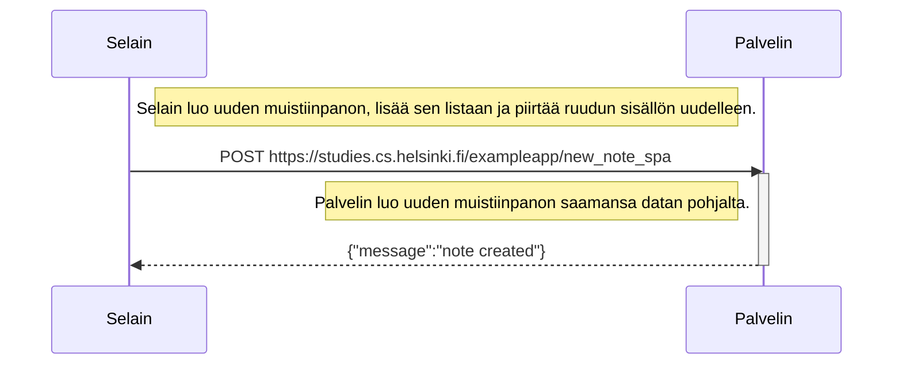

Tehtävä 0.6:

```mermaid
sequenceDiagram
	participant Selain
	participant Palvelin
	
	Note Right of Selain: Selain luo uuden muistiinpanon, lisää sen listaan ja piirtää ruudun sisällön uudelleen.
	
	Selain->>Palvelin: POST https://studies.cs.helsinki.fi/exampleapp/new_note_spa
	activate Palvelin
	Note Left of Palvelin: Palvelin luo uuden muistiinpanon saamansa datan pohjalta.
	Palvelin-->>Selain: {"message":"note created"}
	deactivate Palvelin
```